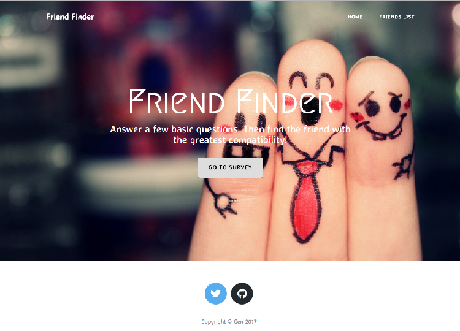
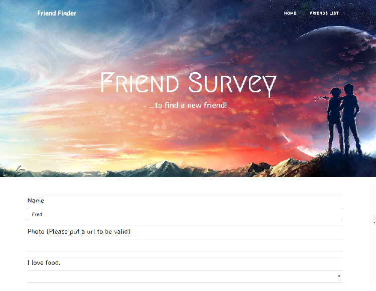

# FriendFinder

### Overview

This compatibility-based application takes in results from your users' surveys, then compare their answers with those from other users. The app will then display the name and picture of the user with the best overall match.


### Instructions
1. User will click on 'Go To Survey' button




2. User will answer and submit 10 questions in the survey.  Using an generated algorithem, it will determine who the user is most compatiable based on data.  




3. The current user's most compatible friend is displayed as a modal pop-up.


3.  User's data will be saved.  User can look at the API Friend's List with the top left button.  It will be formmatted in JSON. 


```json
{
	"name": "Helen",
	"photo": "https://images3.alphacoders.com/734/thumb-1920-734139.png",
	"scores": [
		"3",
		"4",
		"4",
		"3",
		"1",
		"1",
		"3",
		"1",
		"3",
		"5"
	]
}
```


### Technology Used

NodeJS
ExpressJS
Heroku